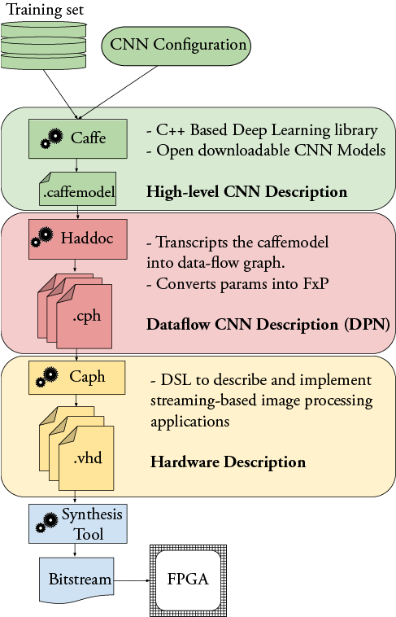

# Haddoc: Hardware Automated Dataflow Description of CNNs

**Warning: This repo is kept here for debug reasons only. It's no longer maintained and the results it delivers are outperformed by the v2 version of the tool [here](https://github.com/KamelAbdelouahab/haddoc2)**




## Clarifications
- A lot of hard-coded paths are present in this repo. Please check the `lib` an `script` files if you have difficulties using Haddoc
- Tool requires Caffe (Only a CPU build is needed), compiled with PyCaffe. PyCaffe should be in your `PYTHONPATH`
- You'll also need the [Caph Compiler](https://github.com/jserot/caph) to generate your DPN and your VHDL code.
- To map the generated VHDL on an FPGA, you'll need a synthesis tool. We use [Quartus II](https://www.intel.com/content/www/us/en/programmable/downloads/download-center.html)
- Acknowledgments to [@cebourrasst](https://github.com/cebourrass) for writing the Caph Actors used in this work, and the first python snippets to generate the Caph network.


## How to use:
From root directory
```bash
>> python script/c2v.py <.prototxt> <.caffemodel> <nbits>
>> cd caph_generated
>> <path_to_caph_bin>/caphc ./cnn_generated -vhdl
```
